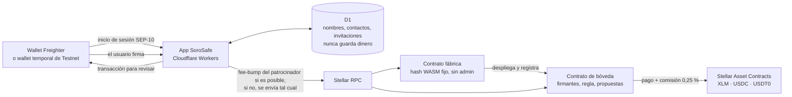

<p align="center">
  <picture>
    <source media="(prefers-color-scheme: dark)" srcset="public/brand/sorosafe-logo-white.svg">
    
  </picture>
</p>

# SoroSafe

[English](README.md) · Español

**Aprobación compartida del dinero de tu empresa, en Stellar.** Una sola dirección de bóveda para los fondos del equipo, reglas que todos pueden ver y pagos que se entienden antes de firmar.

**[Demo en vivo (Testnet)](https://testnet.sorosafe.app)** · **[Contratos en stellar.expert](https://stellar.expert/explorer/testnet/contract/CDPSLPJELYXX33QRHLKHSEFY7ROSWYZ46I7DMSZNG3OGMVX6WURJRSSW)**

> SoroSafe funciona solo en Stellar Testnet. Los fondos de prueba no tienen valor real. Los contratos no han pasado una auditoría independiente.

## El problema

Las pequeñas empresas, equipos y asociaciones que comparten dinero suelen confiar en la wallet o el acceso al banco de una sola persona, más una hoja de cálculo. Quien lleva las finanzas quiere que «dos personas aprueben cada pago», pero las herramientas multifirma actuales están hechas para ingenieros: todos tienen que estar configurados antes de empezar, firmas dos veces para proponer un solo pago, necesitas cripto para pagar gas en cada paso y nada te dice quién es realmente el destinatario.

## Qué hace SoroSafe

- **Empiezas solo y creces después.** Crear una bóveda pide un nombre y una firma de tu wallet. Empiezas como único firmante (1 de 1) y puedes usarla al momento. Añade personas y sube la regla (por ejemplo 2 de 3) cuando el equipo esté listo: hasta 20 firmantes, cualquier umbral de 1 a N, y la bóveda conserva la misma dirección.
- **Una firma por decisión.** Proponer un pago ya cuenta como tu aprobación, y la aprobación que completa la regla envía el pago en esa misma transacción. Nadie firma dos veces y no hay un paso aparte de «ejecutar».
- **Legible antes de firmar.** Cada solicitud muestra destinatario, importe, comisión de servicio, total y contrato del activo. La app reconstruye cada transacción localmente y comprueba contrato, función y argumentos byte a byte antes de pedir la firma a tu wallet.
- **Contactos compartidos.** El equipo mantiene una sola libreta de direcciones con quién añadió cada contacto y cuántos pagos confirmados ha recibido on-chain.
- **Recibos verificables.** Cada operación confirmada enlaza a la transacción y al contrato de la bóveda en stellar.expert.
- **Bilingüe.** Español e inglés en toda la app, incluidos errores y confirmaciones.

## Por qué Stellar

- **Las stablecoins son nativas.** USDC y USDT0 son activos de Stellar con sus propios emisores; los Stellar Asset Contracts (SAC) permiten que una bóveda Soroban los guarde y mueva sin wrappers ni puentes.
- **Las firmas vienen integradas.** `require_auth` de Soroban vincula cada aprobación al contrato, la función y los argumentos exactos, así que SoroSafe no inventa su propio esquema de firmas.
- **Las comisiones son mínimas y las puede pagar otro.** Un fee-bump de Stellar permite que SoroSafe pague la comisión de red de una transacción que firmó el usuario, sin poder modificarla.
- **Finalidad rápida.** Un pago queda firme en unos cinco segundos, así que «aprobar y enviar» se siente como un solo paso.

## Pruébalo en 2 minutos

1. Abre **https://testnet.sorosafe.app**. Entra con [Freighter](https://www.freighter.app/) en la red **Test Net**, o pulsa **Usar wallet temporal** (no instalas nada; su clave se borra al cerrar la pestaña). Las cuentas nuevas de Testnet reciben XLM de prueba de Friendbot.
2. **Crea una bóveda**: escribe un nombre y firma una vez. Eres su único firmante (1 de 1).
3. **Añade fondos**: pasa algo de XLM de prueba a la bóveda. Para USDT0, abre *Añadir fondos* en la fila de USDT0 y pulsa antes **Conseguir 1000 USDT0 de prueba**.
4. **Envía un pago**: como la bóveda es 1 de 1, sale al instante. Abre el recibo en stellar.expert.
5. **Añade un segundo firmante** (otra cuenta de Freighter o una wallet temporal en otro perfil del navegador) y fija la regla en 2 de 2.
6. **Envía otro pago**: ahora queda esperando («1 operación espera tu aprobación» del otro lado). Abre SoroSafe como segundo firmante y elige **Aprobar y completar**: una sola firma aprueba y envía el pago.

## Comisiones de red (gas)

SoroSafe paga la comisión de red por ti **cuando puede**: envuelve la transacción que firmaste en un **fee-bump** de Stellar y paga la comisión en XLM desde una cuenta patrocinadora. El patrocinador firma solo el sobre exterior, así que no puede cambiar la llamada ni autorizar nada en una bóveda.

- Patrocinadas: propuestas, aprobaciones (que también envían el pago), cancelaciones, cambios de equipo y añadir fondos a una bóveda de SoroSafe; en Testnet también los faucets.
- No patrocinadas: crear una bóveda, o cualquier llamada fuera de las bóvedas verificadas de SoroSafe.
- Límites: como máximo 1 XLM por transacción y 20 transacciones patrocinadas por cuenta al día.
- Si no es posible patrocinar (límite alcanzado, patrocinador sin fondos suficientes), se envía la misma transacción firmada y tu wallet paga la comisión, normalmente unos céntimos. Las operaciones nunca se bloquean.

## Modelo de negocio

- Una **comisión de servicio del 0,25 %** sobre los pagos salientes, cobrada en la misma moneda y en la misma transacción que el pago (no se puede saltar ni cobrar por separado). Enviar 2 USDT0 cuesta 2,005 USDT0.
- La comisión se acumula dentro de la bóveda y cualquiera puede enviarla a la cuenta recaudadora con `claim_fees`; financia al patrocinador de gas, que mantiene gratis las operaciones diarias para la mayoría de usuarios. Los pagos nunca dependen de la cuenta recaudadora, así que un problema con ella no puede congelar ninguna bóveda.
- El patrocinio tiene topes (1 XLM por transacción, 20 transacciones por cuenta al día) para que el coste esté acotado.
- Los depósitos, cambios de equipo y aprobaciones no tienen comisión de servicio.

## Cómo usa Stellar

| Pieza | Qué hace |
| --- | --- |
| **Contrato de bóveda (Soroban)** | Guarda tokens SAC (XLM, USDC, USDT0). Almacena firmantes, umbral y propuestas. `propose`, `approve`, `revoke`, `cancel`, `execute`. Los firmantes se autentican con `require_auth`, así que cada aprobación queda vinculada al contrato, la función y los argumentos exactos. |
| **Contrato fábrica** | Despliega una bóveda por equipo desde un hash WASM fijo con un salt determinista y separado por creador, y la registra (`is_vault`) para que la app pueda verificar su origen. Sin administrador, sin actualizaciones, sin clave de retiro. |
| **Cambios de equipo** | Las propuestas `ChangeRules` necesitan el quórum actual. Aplicar una incrementa una época que invalida todas las solicitudes pendientes anteriores. |
| **Comisiones** | Comisión de servicio en el mismo token, calculada con la aritmética de punto fijo auditada de OpenZeppelin (`mul_div_ceil`) y registrada de forma atómica con el pago; queda reservada en la bóveda hasta que `claim_fees` la envía a la cuenta recaudadora. |
| **Stellar Asset Contracts** | Los activos se identifican por contrato + emisor y se resuelven a sus direcciones SAC deterministas. Un ticker por sí solo nunca identifica un token. |
| **Fee-bump** | El patrocinador paga las comisiones de red de las llamadas a bóvedas verificadas cuando puede (ver [Comisiones de red](#comisiones-de-red-gas)). |
| **Freighter + SEP-10** | Inicio de sesión con la wallet. El servidor nunca ve ni guarda claves de usuarios. |
| **Stellar RPC** | Simulación, envío y lectura desde la cadena de todos los saldos, propuestas y aprobaciones. |

Los datos de colaboración (nombres, contactos, invitaciones) viven en Cloudflare D1. Nunca guardan ni controlan dinero: `/contract?network=testnet&address=C…` puede leer y operar cualquier bóveda directamente desde Stellar sin el backend de SoroSafe.

## Arquitectura



Estructura del repositorio (nombre interno **junto**: nombre del paquete, variables de entorno `JUNTO_*`, `junto_*.wasm`):

```
contracts/            Rust, soroban-sdk 26
  vault/              bóveda compartida: propuestas, aprobaciones, quórum, comisión acumulada
  factory/            despliega y registra bóvedas desde un hash WASM fijo
  types/              reglas y validación del protocolo compartidas por ambos
app/                  UI en React y rutas de API (vinext en Cloudflare Workers)
lib/                  cliente Stellar RPC, autenticación SEP-10, comprobación de transacciones
db/, drizzle/         esquema y migraciones de D1 para los datos de colaboración
scripts/              compilación de contratos, fábrica de Testnet y despliegue en Cloudflare
tests/                pruebas de regresión sin red y flujos reales en Testnet
docs/                 modelo de seguridad, archivos de evidencia, guion del vídeo
```

## Desplegado en Testnet

Todas las direcciones enlazan a [stellar.expert](https://stellar.expert/explorer/testnet). La fuente de verdad es `lib/testnet-tokens.json`, `lib/contract-artifacts.json` y `docs/testnet-demo-factory.json`.

| Qué | Dirección |
| --- | --- |
| App | https://testnet.sorosafe.app (Cloudflare Workers + D1) |
| Fábrica | [`CDPSLPJELYXX33QRHLKHSEFY7ROSWYZ46I7DMSZNG3OGMVX6WURJRSSW`](https://stellar.expert/explorer/testnet/contract/CDPSLPJELYXX33QRHLKHSEFY7ROSWYZ46I7DMSZNG3OGMVX6WURJRSSW) |
| SHA-256 del WASM de la bóveda | `7c95b9a72fdc9fd242d7b44214ab53f46018e62e28ff68500b71e1b1af2d023d` |
| SHA-256 del WASM de la fábrica | `8b78a84b1186e59e31e94f9352ff2fd1e8ffa1ea31ca43099a0fca949e9477ca` |
| XLM (SAC) | [`CDLZFC3SYJYDZT7K67VZ75HPJVIEUVNIXF47ZG2FB2RMQQVU2HHGCYSC`](https://stellar.expert/explorer/testnet/contract/CDLZFC3SYJYDZT7K67VZ75HPJVIEUVNIXF47ZG2FB2RMQQVU2HHGCYSC) |
| USDC (Testnet de Circle, SAC) | [`CBIELTK6YBZJU5UP2WWQEUCYKLPU6AUNZ2BQ4WWFEIE3USCIHMXQDAMA`](https://stellar.expert/explorer/testnet/contract/CBIELTK6YBZJU5UP2WWQEUCYKLPU6AUNZ2BQ4WWFEIE3USCIHMXQDAMA), emisor [`GBBD47IF…LFLA5`](https://stellar.expert/explorer/testnet/account/GBBD47IF6LWK7P7MDEVSCWR7DPUWV3NY3DTQEVFL4NAT4AQH3ZLLFLA5) |
| Faucet de USDC | [`CAHA4GQU75Y7QJX64AYUTYBP6GPGTS7LGWKI3DIKQ57JFUIE2F6Y7SKD`](https://stellar.expert/explorer/testnet/contract/CAHA4GQU75Y7QJX64AYUTYBP6GPGTS7LGWKI3DIKQ57JFUIE2F6Y7SKD) (si está vacío, usa [el faucet de Circle](https://faucet.circle.com/)) |
| USDT0 (de prueba de SoroSafe, SAC) | [`CCQOQVXDBJXRP52V34GYSD7XTTJXY27NUQDNBW2MHRZG6TEF2HCSUMKP`](https://stellar.expert/explorer/testnet/contract/CCQOQVXDBJXRP52V34GYSD7XTTJXY27NUQDNBW2MHRZG6TEF2HCSUMKP), emisor [`GCCYRCUZ…J5S4`](https://stellar.expert/explorer/testnet/account/GCCYRCUZU36KZCHRJX7AFWHRTE7ZRJ3VKRBMTQC5VNIZ3KZ5T77PJ5S4) |
| Faucet de USDT0 | [`CAVLWTDJCALTUZY47ECCAOOCBGF6R4S7I3NI637SZX33VDI6FZNERVXZ`](https://stellar.expert/explorer/testnet/contract/CAVLWTDJCALTUZY47ECCAOOCBGF6R4S7I3NI637SZX33VDI6FZNERVXZ) |
| Patrocinador de gas | [`GCREJ6HQVT4TR4AV3FDGQVXB7BEI4KDAI2UFCT7CJYWJOE7N3NPJD2FQ`](https://stellar.expert/explorer/testnet/account/GCREJ6HQVT4TR4AV3FDGQVXB7BEI4KDAI2UFCT7CJYWJOE7N3NPJD2FQ) |
| Recaudador de comisiones | [`GDZGXG7Y3FYOZ7AFUDO6GLQCIUMWIMBHANYM7FAVORP46VOU572YNIG7`](https://stellar.expert/explorer/testnet/account/GDZGXG7Y3FYOZ7AFUDO6GLQCIUMWIMBHANYM7FAVORP46VOU572YNIG7) |

La app comprueba on-chain ambos hashes WASM y el registro en la fábrica antes de operar una bóveda.

**Sobre USDT0 en Testnet.** USDT0 no tiene un despliegue oficial en Testnet, así que SoroSafe emitió un USDT0 de prueba con suministro fijo (emisor bloqueado tras acuñar) que guarda un contrato faucet: **Añadir fondos → Conseguir 1000 USDT0 de prueba** añade la trustline y lo reclama (una vez al día por cuenta). En Mainnet se usarán los emisores oficiales de USDC y USDT0.

### Prueba on-chain

[Esta transacción](https://stellar.expert/explorer/testnet/tx/b989375a632c0874a8b0622efb0fb2e5c57ca4bf9b50d1e1dabefd0bd85611e1) es la única aprobación del segundo firmante en una bóveda 2 de 2. En una sola transacción registra la aprobación, envía **2 USDT0** al destinatario y cobra la comisión de servicio de **0,005 USDT0** (0,25 %). (Este recibo es de la fábrica anterior, que enviaba la comisión directamente al recaudador; los contratos actuales la dejan pendiente en la bóveda hasta `claim_fees`.) Es un fee-bump: la cuenta que paga la comisión es el patrocinador de gas de SoroSafe, así que el firmante no pagó XLM.

Hay más recibos de ejecuciones automáticas en Testnet en `docs/soroban-testnet-evidence.json` y `docs/testnet-demo-factory.json`.

## Verificación

| Suite | Resultado |
| --- | --- |
| Tests Rust de los contratos (`npm run contracts:test`) | 35/35 (bóveda 28, fábrica 5, faucet 2) |
| Flujo real en Testnet con wallets de Friendbot (`npm run test:soroban`) | 21/21, recibos en `docs/soroban-testnet-evidence.json` |
| Alta y creación de bóveda de extremo a extremo por la API (`tests/contracts-onboarding.mjs`) | 19/19, también contra la app desplegada |
| Tests de regresión del backend (`npm run test:audit-regressions`) | 36/36 |
| Codificación de transacciones en el cliente (`npm run test:contracts-client`) | pasa (1..20 firmantes, umbral 1..N, identidad de monedas) |

## Ejecutar en local

Node 22.13+, Rust 1.94.1 con el target `wasm32v1-none`, Stellar CLI 25.2.0+.

```sh
npm ci
npm run db:local && npm run db:local:upgrade && npm run db:local:contracts \
  && npm run db:local:auth && npm run db:local:auth-limits && npm run db:local:attempts
node scripts/setup-local-auth.mjs
# .dev.vars: JUNTO_NETWORK=testnet y JUNTO_FACTORY=<dirección C… de la fábrica>
npm run dev -- --host 127.0.0.1 --port 8789
```

Compila y prueba los contratos con `npm run contracts:build && npm run contracts:test`. `npm run contracts:deploy-testnet` despliega una fábrica de demo nueva con cuentas efímeras de Friendbot; `npm run deploy:testnet` publica la app en Cloudflare.

## Seguridad y preparación para Mainnet

- **Sin auditoría independiente.** Lee [el modelo de seguridad](docs/CONTRACT-SECURITY.md) para conocer riesgos y temas abiertos.
- **Solo Testnet.** No se ha desplegado ninguna fábrica de SoroSafe en Mainnet.
- La V1 solo mueve los tokens SAC listados al desplegar la fábrica. Sin llamadas arbitrarias, allowances ni actualizaciones.
- Los firmantes son cuentas G de Stellar. Freighter es la wallet integrada; passkeys y más wallets están planificadas.
- No envíes a la dirección C… de una bóveda un pago clásico ni un retiro de exchange que exija memo.

### Correcciones de contratos en esta versión

Corregido tras una revisión interna de los contratos (todo cubierto por tests):

- **Las comisiones no pueden congelar pagos.** La comisión de servicio ya no se envía a la cuenta recaudadora dentro de cada pago. Se acumula en la bóveda (`fees_owed`) y cualquiera puede retirarla con `claim_fees`. Si la cuenta recaudadora pierde su trustline o queda congelada, solo falla esa retirada; los pagos siguen funcionando. Un pago nunca puede gastar comisiones pendientes.
- **Las solicitudes sin fondos quedan pendientes.** En una bóveda 1 de 1, un pago que la bóveda aún no puede cubrir se guarda como solicitud pendiente en lugar de revertirse, y se completa después con «Completar pago».
- **Se rechazan importes que el token no puede mover** (importe + comisión por encima del límite de los activos de Stellar).
- **Retirar una aprobación que no diste falla con un error claro** en vez de emitir un evento engañoso.
- **Se comprueba el destinatario antes de pedir un pago** (que la cuenta exista y pueda recibir la moneda), así una aprobación no puede fallar en el último paso.
- **El patrocinio nunca bloquea.** Si el fee-bump no se puede patrocinar o falla antes de llegar al ledger, se envía la misma transacción firmada y paga quien firma; un fee-bump rechazado no gasta el cupo diario.

### Antes de Mainnet

- [ ] Auditoría externa independiente del WASM de la bóveda y la fábrica y del flujo de firma de la app.
- [ ] Un proceso que mantenga vivo el TTL del almacenamiento de instancias, código y propuestas (y una forma de restaurar entradas archivadas).
- [ ] Límites del patrocinador ajustados para Mainnet, con monitorización del saldo de XLM del patrocinador.
- [ ] Cuenta recaudadora de comisiones en una wallet hardware o una multifirma.
- [ ] Sin faucets en Mainnet: solo los emisores oficiales de USDC y USDT0.

## Hoja de ruta

1. **Lanzamiento en Mainnet.** Fábrica de Mainnet con XLM, USDC y USDT0 (direcciones SAC oficiales ya verificadas en solo lectura).
2. **Flujo de equipo.** Notificaciones cuando un pago espera tu aprobación y enlaces de invitación para nuevos firmantes.
3. **Wallets más fáciles.** Passkeys y smart wallets, y más wallets (incluidas móviles) con Stellar Wallets Kit.
4. **Auditoría independiente** antes de custodiar fondos relevantes.

## Equipo

- **Fabián Fariñas** ([@ffarinas](https://github.com/ffarinas)) · Fundador, producto e ingeniería

## Licencia

[MIT](LICENSE)
