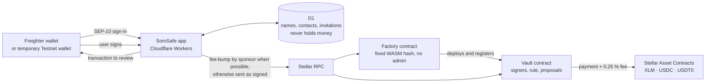

<p align="center">
  <picture>
    <source media="(prefers-color-scheme: dark)" srcset="public/brand/sorosafe-logo-white.svg">
    
  </picture>
</p>

# SoroSafe

English · [Español](README.es.md)

**Shared approval of company money, on Stellar.** One vault address for the team's funds, rules everybody can see, and payments people understand before they sign.

**[Live demo (Testnet)](https://testnet.sorosafe.app)** · **[Contracts on stellar.expert](https://stellar.expert/explorer/testnet/contract/CDPSLPJELYXX33QRHLKHSEFY7ROSWYZ46I7DMSZNG3OGMVX6WURJRSSW)**

> SoroSafe runs on Stellar Testnet only. Test funds have no real value. The contracts have not been independently audited.

## The problem

Small companies, teams and associations that share money usually trust one person's wallet or bank login and a spreadsheet. A finance lead wants "two people must approve every payment", but existing multisig tools are built for engineers: everyone has to be set up before you can start, you sign twice to propose one payment, you need crypto for gas at every step, and nothing tells you who the recipient really is.

## What SoroSafe does

- **Start alone, grow later.** Creating a vault takes a name and one wallet signature. You start as the only signer (1 of 1) and can use it right away. Add people and raise the rule (for example 2 of 3) whenever the team is ready: up to 20 signers, any threshold from 1 to N, and the vault keeps the same address.
- **One signature per decision.** Proposing a payment already counts as your approval, and the approval that completes the rule sends the payment in that same transaction. Nobody signs twice, and there is no separate "execute" step.
- **Readable before signing.** Every request shows recipient, amount, service fee, total and asset contract. The app rebuilds each transaction locally and checks contract, function and arguments byte for byte before asking your wallet to sign.
- **Shared contacts.** The team keeps one address book with who added each contact and how many confirmed payments it has received on-chain.
- **Verifiable receipts.** Every confirmed operation links to the transaction and the vault contract on stellar.expert.
- **Bilingual.** Spanish and English throughout, including errors and confirmations.

## Why Stellar

- **Stablecoins are native.** USDC and USDT0 are Stellar assets with their own issuers; Stellar Asset Contracts (SACs) let a Soroban vault hold and move them without wrapping or bridges.
- **Signatures are built in.** Soroban's `require_auth` binds every approval to the exact contract, function and arguments, so SoroSafe does not invent its own signature scheme.
- **Fees are tiny, and someone else can pay them.** A Stellar fee-bump lets SoroSafe pay the network fee for a transaction the user signed, without being able to change it.
- **Fast finality.** A payment is final in about five seconds, so "approve and send" feels like one step.

## Try it in 2 minutes

1. Open **https://testnet.sorosafe.app**. Sign in with [Freighter](https://www.freighter.app/) switched to **Test Net**, or press **Use a temporary wallet** (nothing to install; its key is discarded when you close the tab). New Testnet accounts are funded with test XLM from Friendbot.
2. **Create a vault**: type a name and sign once. You are its only signer (1 of 1).
3. **Add funds**: move some test XLM into the vault. For USDT0, open *Add funds* on the USDT0 row and press **Get 1000 test USDT0** first.
4. **Send a payment**: as a 1-of-1 vault it goes out immediately. Open the receipt on stellar.expert.
5. **Add a second signer** (another Freighter account or a temporary wallet in a second browser profile) and set the rule to 2 of 2.
6. **Send another payment**: now it waits ("1 operation is waiting for your approval" on the other side). Open SoroSafe as the second signer and choose **Approve and complete**: one signature approves and sends the payment.

## Network fees (gas)

SoroSafe pays the network fee for you **when it can**: it wraps the transaction you signed in a Stellar **fee-bump** and pays the fee in XLM from a sponsor account. The sponsor signs only the outer envelope, so it cannot change the call or authorize anything in a vault.

- Sponsored: proposals, approvals (which also send the payment), cancellations, team changes and adding funds to a SoroSafe vault; on Testnet also the faucets.
- Not sponsored: creating a vault, or any call outside SoroSafe's verified vaults.
- Limits: at most 1 XLM per transaction and 20 sponsored transactions per account per day.
- If sponsorship isn't possible (limit reached, sponsor low on funds), the same signed transaction is submitted and your wallet pays the fee, usually a few cents. Operations are never blocked.

## Business model

- A **0.25 % service fee** on outgoing payments, charged in the same currency and in the same transaction as the payment (it can't be skipped or charged separately). Sending 2 USDT0 costs 2.005 USDT0.
- The fee accrues inside the vault and anyone can sweep it to the collector account with `claim_fees`; it funds the gas sponsor, which keeps everyday operations free for most users. Payments never depend on the collector, so a problem with that account can't freeze any vault.
- Sponsorship is capped (1 XLM per transaction, 20 transactions per account per day) so the cost stays bounded.
- Deposits, team changes and approvals carry no service fee.

## How it uses Stellar

| Piece | What it does |
| --- | --- |
| **Vault contract (Soroban)** | Holds SAC tokens (XLM, USDC, USDT0). Stores signers, threshold and proposals. `propose`, `approve`, `revoke`, `cancel`, `execute`. Signers are authenticated with `require_auth`, so each approval is bound to the exact contract, function and arguments. |
| **Factory contract** | Deploys one vault per team from a fixed WASM hash with a deterministic, creator-namespaced salt, and registers it (`is_vault`) so the app can verify a vault's origin. No admin, no upgrade, no withdrawal key. |
| **Team changes** | `ChangeRules` proposals need the current quorum. Applying one bumps an epoch that invalidates every older pending request. |
| **Fees** | Service fee in the same token, computed with OpenZeppelin's audited fixed-point math (`mul_div_ceil`) and recorded atomically with the payment; it stays reserved in the vault until `claim_fees` sends it to the collector. |
| **Stellar Asset Contracts** | Assets are identified by contract + issuer and resolved to their deterministic SAC addresses. A ticker alone never identifies a token. |
| **Fee-bump** | The sponsor pays network fees for verified vault calls when it can (see [Network fees](#network-fees-gas)). |
| **Freighter + SEP-10** | Wallet-based sign-in. The server never sees or stores user keys. |
| **Stellar RPC** | Simulation, submission and all balances, proposals and approvals are read from the chain. |

Collaboration data (names, contacts, invitations) lives in Cloudflare D1. It never holds or controls money: `/contract?network=testnet&address=C…` can read and operate any vault directly from Stellar without SoroSafe's backend.

## Architecture



Repository layout (internal codename **junto**: package name, `JUNTO_*` environment variables, `junto_*.wasm`):

```
contracts/            Rust, soroban-sdk 26
  vault/              shared vault: proposals, approvals, quorum, accrued fee
  factory/            deploys and registers vaults from a fixed WASM hash
  types/              rules and protocol validation shared by both
app/                  React UI and API routes (vinext on Cloudflare Workers)
lib/                  Stellar RPC client, SEP-10 auth, transaction checks
db/, drizzle/         D1 schema and migrations for collaboration data
scripts/              contract build, Testnet factory and Cloudflare deploy
tests/                offline regression suites and live Testnet flows
docs/                 security model, evidence files, video script
```

## Deployed on Testnet

All addresses link to [stellar.expert](https://stellar.expert/explorer/testnet). The source of truth is `lib/testnet-tokens.json`, `lib/contract-artifacts.json` and `docs/testnet-demo-factory.json`.

| What | Address |
| --- | --- |
| App | https://testnet.sorosafe.app (Cloudflare Workers + D1) |
| Factory | [`CDPSLPJELYXX33QRHLKHSEFY7ROSWYZ46I7DMSZNG3OGMVX6WURJRSSW`](https://stellar.expert/explorer/testnet/contract/CDPSLPJELYXX33QRHLKHSEFY7ROSWYZ46I7DMSZNG3OGMVX6WURJRSSW) |
| Vault WASM SHA-256 | `7c95b9a72fdc9fd242d7b44214ab53f46018e62e28ff68500b71e1b1af2d023d` |
| Factory WASM SHA-256 | `8b78a84b1186e59e31e94f9352ff2fd1e8ffa1ea31ca43099a0fca949e9477ca` |
| XLM (SAC) | [`CDLZFC3SYJYDZT7K67VZ75HPJVIEUVNIXF47ZG2FB2RMQQVU2HHGCYSC`](https://stellar.expert/explorer/testnet/contract/CDLZFC3SYJYDZT7K67VZ75HPJVIEUVNIXF47ZG2FB2RMQQVU2HHGCYSC) |
| USDC (Circle Testnet, SAC) | [`CBIELTK6YBZJU5UP2WWQEUCYKLPU6AUNZ2BQ4WWFEIE3USCIHMXQDAMA`](https://stellar.expert/explorer/testnet/contract/CBIELTK6YBZJU5UP2WWQEUCYKLPU6AUNZ2BQ4WWFEIE3USCIHMXQDAMA), issuer [`GBBD47IF…LFLA5`](https://stellar.expert/explorer/testnet/account/GBBD47IF6LWK7P7MDEVSCWR7DPUWV3NY3DTQEVFL4NAT4AQH3ZLLFLA5) |
| USDC faucet | [`CAHA4GQU75Y7QJX64AYUTYBP6GPGTS7LGWKI3DIKQ57JFUIE2F6Y7SKD`](https://stellar.expert/explorer/testnet/contract/CAHA4GQU75Y7QJX64AYUTYBP6GPGTS7LGWKI3DIKQ57JFUIE2F6Y7SKD) (when empty, use [Circle's faucet](https://faucet.circle.com/)) |
| USDT0 (SoroSafe test, SAC) | [`CCQOQVXDBJXRP52V34GYSD7XTTJXY27NUQDNBW2MHRZG6TEF2HCSUMKP`](https://stellar.expert/explorer/testnet/contract/CCQOQVXDBJXRP52V34GYSD7XTTJXY27NUQDNBW2MHRZG6TEF2HCSUMKP), issuer [`GCCYRCUZ…J5S4`](https://stellar.expert/explorer/testnet/account/GCCYRCUZU36KZCHRJX7AFWHRTE7ZRJ3VKRBMTQC5VNIZ3KZ5T77PJ5S4) |
| USDT0 faucet | [`CAVLWTDJCALTUZY47ECCAOOCBGF6R4S7I3NI637SZX33VDI6FZNERVXZ`](https://stellar.expert/explorer/testnet/contract/CAVLWTDJCALTUZY47ECCAOOCBGF6R4S7I3NI637SZX33VDI6FZNERVXZ) |
| Gas sponsor | [`GCREJ6HQVT4TR4AV3FDGQVXB7BEI4KDAI2UFCT7CJYWJOE7N3NPJD2FQ`](https://stellar.expert/explorer/testnet/account/GCREJ6HQVT4TR4AV3FDGQVXB7BEI4KDAI2UFCT7CJYWJOE7N3NPJD2FQ) |
| Fee collector | [`GDZGXG7Y3FYOZ7AFUDO6GLQCIUMWIMBHANYM7FAVORP46VOU572YNIG7`](https://stellar.expert/explorer/testnet/account/GDZGXG7Y3FYOZ7AFUDO6GLQCIUMWIMBHANYM7FAVORP46VOU572YNIG7) |

The app checks both WASM hashes and the factory registration on-chain before operating a vault.

**About USDT0 on Testnet.** USDT0 has no official Testnet deployment, so SoroSafe issued a fixed-supply test USDT0 (issuer locked after minting) held by a faucet contract: **Add funds → Get 1000 test USDT0** adds the trustline and claims it (once a day per account). Mainnet will use the official USDC and USDT0 issuers.

### Proof on-chain

[This transaction](https://stellar.expert/explorer/testnet/tx/b989375a632c0874a8b0622efb0fb2e5c57ca4bf9b50d1e1dabefd0bd85611e1) is the second signer's single approval on a 2-of-2 vault. In one transaction it records the approval, sends **2 USDT0** to the recipient and charges the **0.005 USDT0** (0.25 %) service fee. (This receipt comes from the previous factory, which sent the fee straight to the collector; the current contracts keep it owed in the vault until `claim_fees`.) It is a fee-bump: the fee source account is the SoroSafe gas sponsor, so the signer paid no XLM.

More receipts from automated Testnet runs are in `docs/soroban-testnet-evidence.json` and `docs/testnet-demo-factory.json`.

## Verification

| Suite | Result |
| --- | --- |
| Rust contract tests (`npm run contracts:test`) | 35/35 (vault 28, factory 5, faucet 2) |
| Real Testnet flow with Friendbot wallets (`npm run test:soroban`) | 21/21, receipts in `docs/soroban-testnet-evidence.json` |
| End-to-end sign-up and vault creation through the API (`tests/contracts-onboarding.mjs`) | 19/19, also run against the deployed app |
| Backend regression tests (`npm run test:audit-regressions`) | 36/36 |
| Client transaction encoding (`npm run test:contracts-client`) | passes (1..20 signers, threshold 1..N, asset identity) |

## Run locally

Node 22.13+, Rust 1.94.1 with target `wasm32v1-none`, Stellar CLI 25.2.0+.

```sh
npm ci
npm run db:local && npm run db:local:upgrade && npm run db:local:contracts \
  && npm run db:local:auth && npm run db:local:auth-limits && npm run db:local:attempts
node scripts/setup-local-auth.mjs
# .dev.vars: JUNTO_NETWORK=testnet and JUNTO_FACTORY=<factory C… address>
npm run dev -- --host 127.0.0.1 --port 8789
```

Build and test the contracts with `npm run contracts:build && npm run contracts:test`. `npm run contracts:deploy-testnet` deploys a fresh demo factory with ephemeral Friendbot accounts; `npm run deploy:testnet` publishes the app to Cloudflare.

## Security & Mainnet readiness

- **Not independently audited.** Read [the security model](docs/CONTRACT-SECURITY.md) for risks and open items.
- **Testnet only.** No SoroSafe factory has been deployed to Mainnet.
- V1 only moves the SAC tokens listed when the factory was deployed. No arbitrary calls, allowances or upgrades.
- Signers are Stellar G accounts. Freighter is the integrated wallet; passkeys and more wallets are planned.
- A classic payment or an exchange withdrawal that requires a memo must not be sent to a vault's C… address.

### Contract fixes in this release

Fixed after an internal review of the contracts (all covered by tests):

- **Fees can't freeze payments.** The service fee is no longer pushed to the collector inside each payment. It accrues in the vault (`fees_owed`) and anyone can sweep it with `claim_fees`. If the collector loses its trustline or gets frozen, only the sweep fails; payments keep working. Payments can never spend fees that are owed.
- **Unfunded requests stay pending.** In a 1-of-1 vault, a payment the vault can't cover yet is saved as a pending request instead of reverting, and runs later with "Complete payment".
- **Amounts the token can't move are rejected** (amount + fee above the Stellar asset limit).
- **Withdrawing an approval you never gave fails with a clear error** instead of emitting a misleading event.
- **Recipients are checked before a payment is requested** (account exists and can hold the currency), so an approval can't fail at the last step.
- **Sponsorship never blocks.** If the fee-bump can't be sponsored or fails before reaching the ledger, the same signed transaction is submitted and the signer pays; a rejected fee-bump doesn't consume the daily allowance.

### Before Mainnet

- [ ] Independent external audit of the vault and factory WASM and the app's signing flow.
- [ ] Storage TTL keeper that keeps vault instances, code and proposals live (and a restore path for archived entries).
- [ ] Sponsor rate limits tuned for Mainnet, with monitoring of the sponsor's XLM balance.
- [ ] Fee collector account on a hardware wallet or a multisig.
- [ ] No faucets on Mainnet: only the official USDC and USDT0 issuers.

## Roadmap

1. **Mainnet launch.** Mainnet factory with XLM, USDC and USDT0 (official SAC addresses already verified read-only).
2. **Team workflow.** Notifications when a payment waits for your approval, and invite links for new signers.
3. **Easier wallets.** Passkeys and smart wallets, plus more wallets (including mobile) through Stellar Wallets Kit.
4. **Independent audit** before holding meaningful funds.

## Team

- **Fabián Fariñas** ([@ffarinas](https://github.com/ffarinas)) · Founder, product & engineering

## License

[MIT](LICENSE)
